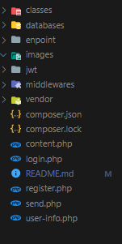

# php-login-regis-emailer-api

## Requirement in application

* "**Composer**" - For install library PHPmailer
* "**JWT**" - For Authentication 
* "**Postman**" - For test API

## Structure Folder Application

called php-login-regis-emailer-api. This is our application folder.<br>   
Inside the application folder, we will create the following files and folders.
<br>

<br>

## JWT Folder
* Download the JWT Package from [Here](https://github.com/firebase/php-jwt)
* Extract the ZIP file.
* Copy the "**src**" folder inside the php-login-regis-emailer-api folder.
* Rename the "**src**" folder to "**jwt**".

## Classes Folder
Now inside the application folder, you have to create a new folder called classes. After that, inside the classes folder, we will create two files or classes –
<br>

* "**Database.php**" – For making the database connection
* "**JwtHandler.php**" – For handling the JWT actions like encoding and decoding token
  
<br>

### Database.php
```php
<?php
class Database
{

    // CHANGE THE DB INFO ACCORDING TO YOUR DATABASE
    private $db_host = 'localhost';
    private $db_name = 'emailsend';
    private $db_username = 'postgres';
    private $db_password = 'root';
    private $port       =  '5432';

    public function dbConnection()
    {

        try {
            $conn = new PDO('pgsql:host=' . $this->db_host . ';dbname=' . $this->db_name, $this->db_username, $this->db_password);
            $conn->setAttribute(PDO::ATTR_ERRMODE, PDO::ERRMODE_EXCEPTION);
            return $conn;
        } catch (PDOException $e) {
            echo "Connection error " . $e->getMessage();
            exit;
        }
    }
}
```
<br>

### JwtHandler.php
```php
<?php
require __DIR__ . '/../jwt/JWT.php';
require __DIR__ . '/../jwt/ExpiredException.php';
require __DIR__ . '/../jwt/SignatureInvalidException.php';
require __DIR__ . '/../jwt/BeforeValidException.php';

use \Firebase\JWT\JWT;

class JwtHandler
{
    protected $jwt_secrect;
    protected $token;
    protected $issuedAt;
    protected $expire;
    protected $jwt;

    public function __construct()
    {
        // set your default time-zone
        date_default_timezone_set('Asia/Jakarta');
        $this->issuedAt = time();

        // Token Validity (3600 second = 1hr)
        $this->expire = $this->issuedAt + 3600;

        // Set your secret or signature
        $this->jwt_secrect = "this_is_my_secrect";
    }

    // ENCODING THE TOKEN
    public function _jwt_encode_data($iss, $data)
    {

        $this->token = array(
            //Adding the identifier to the token (who issue the token)
            "iss" => $iss,
            "aud" => $iss,
            // Adding the current timestamp to the token, for identifying that when the token was issued.
            "iat" => $this->issuedAt,
            // Token expiration
            "exp" => $this->expire,
            // Payload
            "data" => $data
        );

        $this->jwt = JWT::encode($this->token, $this->jwt_secrect);
        return $this->jwt;
    }

    protected function _errMsg($msg)
    {
        return [
            "auth" => 0,
            "message" => $msg
        ];
    }

    //DECODING THE TOKEN
    public function _jwt_decode_data($jwt_token)
    {
        try {
            $decode = JWT::decode($jwt_token, $this->jwt_secrect, array('HS256'));
            return [
                "auth" => 1,
                "data" => $decode->data
            ];
        } catch (\Firebase\JWT\ExpiredException $e) {
            return $this->_errMsg($e->getMessage());
        } catch (\Firebase\JWT\SignatureInvalidException $e) {
            return $this->_errMsg($e->getMessage());
        } catch (\Firebase\JWT\BeforeValidException $e) {
            return $this->_errMsg($e->getMessage());
        } catch (\DomainException $e) {
            return $this->_errMsg($e->getMessage());
        } catch (\InvalidArgumentException $e) {
            return $this->_errMsg($e->getMessage());
        } catch (\UnexpectedValueException $e) {
            return $this->_errMsg($e->getMessage());
        }
    }
}
```
<br>

## middlewares folder
And inside the middlewares folder, you just have to create one class –

<br>

* **Auth.php** - For validating the token (checking if the token is valid or not)
* **Valid Token** – return the User
* **Invalid Token** - return **null**

### Auth.php

```php
<?php
require __DIR__ . '/../classes/JwtHandler.php';
class Auth extends JwtHandler
{

    protected $db;
    protected $headers;
    protected $token;
    public function __construct($db, $headers)
    {
        parent::__construct();
        $this->db = $db;
        $this->headers = $headers;
    }

    public function isAuth()
    {
        if (array_key_exists('Authorization', $this->headers) && !empty(trim($this->headers['Authorization']))) :
            $this->token = explode(" ", trim($this->headers['Authorization']));
            if (isset($this->token[1]) && !empty(trim($this->token[1]))) :

                $data = $this->_jwt_decode_data($this->token[1]);

                if (isset($data['auth']) && isset($data['data']->user_id) && $data['auth']) :
                    $user = $this->fetchUser($data['data']->user_id);
                    return $user;

                else :
                    return null;

                endif; // End of isset($this->token[1]) && !empty(trim($this->token[1]))

            else :
                return null;

            endif; // End of isset($this->token[1]) && !empty(trim($this->token[1]))

        else :
            return null;

        endif;
    }

    protected function fetchUser($user_id)
    {
        try {
            $fetch_user_by_id = "SELECT name,email FROM users WHERE id=:id";
            $query_stmt = $this->db->prepare($fetch_user_by_id);
            $query_stmt->bindValue(':id', $user_id, PDO::PARAM_INT);
            $query_stmt->execute();

            if ($query_stmt->rowCount()) :
                $row = $query_stmt->fetch(PDO::FETCH_ASSOC);
                return [
                    'success' => 1,
                    'status' => 200,
                    'user' => $row
                ];
            else :
                return null;
            endif;
        } catch (PDOException $e) {
            return null;
        }
    }
}
```
<br>

## Other files

base files -

* **register.php** – For user registration
* **login.php** - For user login
* **user-info.php** - After login, this page is accessible with a valid token.
* **send.php** - Send email with user auth
* **content.php** - For fill send email in inbox email accept

### register.php

```php
<?php
header("Access-Control-Allow-Origin: *");
header("Access-Control-Allow-Headers: access");
header("Access-Control-Allow-Methods: POST");
header("Content-Type: application/json; charset=UTF-8");
header("Access-Control-Allow-Headers: Content-Type, Access-Control-Allow-Headers, Authorization, X-Requested-With");

function msg($success, $status, $message, $extra = [])
{
    return array_merge([
        'success' => $success,
        'status' => $status,
        'message' => $message
    ], $extra);
}

// INCLUDING DATABASE AND MAKING OBJECT
require __DIR__ . '/classes/Database.php';
$db_connection = new Database();
$conn = $db_connection->dbConnection();

// GET DATA FORM REQUEST
$data = json_decode(file_get_contents("php://input"));
$returnData = [];

// IF REQUEST METHOD IS NOT POST
if ($_SERVER["REQUEST_METHOD"] != "POST") :
    $returnData = msg(0, 404, 'Page Not Found!');

// CHECKING EMPTY FIELDS
elseif (
    !isset($data->name)
    || !isset($data->email)
    || !isset($data->password)
    || empty(trim($data->name))
    || empty(trim($data->email))
    || empty(trim($data->password))
) :

    $fields = ['fields' => ['name', 'email', 'password']];
    $returnData = msg(0, 422, 'Please Fill in all Required Fields!', $fields);

// IF THERE ARE NO EMPTY FIELDS THEN-
else :

    $name = trim($data->name);
    $email = trim($data->email);
    $password = trim($data->password);

    if (!filter_var($email, FILTER_VALIDATE_EMAIL)) :
        $returnData = msg(0, 422, 'Invalid Email Address!');

    elseif (strlen($password) < 8) :
        $returnData = msg(0, 422, 'Your password must be at least 8 characters long!');

    elseif (strlen($name) < 3) :
        $returnData = msg(0, 422, 'Your name must be at least 3 characters long!');

    else :
        try {

            $check_email = "SELECT email FROM users WHERE email=:email";
            $check_email_stmt = $conn->prepare($check_email);
            $check_email_stmt->bindValue(':email', $email, PDO::PARAM_STR);
            $check_email_stmt->execute();

            if ($check_email_stmt->rowCount()) :
                $returnData = msg(0, 422, 'This E-mail already in use!');

            else :
                $insert_query = "INSERT INTO users(name,email,password) VALUES(:name,:email,:password)";

                $insert_stmt = $conn->prepare($insert_query);

                // DATA BINDING
                $insert_stmt->bindValue(':name', htmlspecialchars(strip_tags($name)), PDO::PARAM_STR);
                $insert_stmt->bindValue(':email', $email, PDO::PARAM_STR);
                $insert_stmt->bindValue(':password', password_hash($password, PASSWORD_DEFAULT), PDO::PARAM_STR);

                $insert_stmt->execute();

                $returnData = msg(1, 201, 'You have successfully registered.');

            endif;
        } catch (PDOException $e) {
            $returnData = msg(0, 500, $e->getMessage());
        }
    endif;

endif;

echo json_encode($returnData);
```

### login.php

```php
<?php
header("Access-Control-Allow-Origin: *");
header("Access-Control-Allow-Headers: access");
header("Access-Control-Allow-Methods: POST");
header("Content-Type: application/json; charset=UTF-8");
header("Access-Control-Allow-Headers: Content-Type, Access-Control-Allow-Headers, Authorization, X-Requested-With");

function msg($success, $status, $message, $extra = [])
{
    return array_merge([
        'success' => $success,
        'status' => $status,
        'message' => $message
    ], $extra);
}

require __DIR__ . '/classes/Database.php';
require __DIR__ . '/classes/JwtHandler.php';

$db_connection = new Database();
$conn = $db_connection->dbConnection();

$data = json_decode(file_get_contents("php://input"));
$returnData = [];

// IF REQUEST METHOD IS NOT EQUAL TO POST
if ($_SERVER["REQUEST_METHOD"] != "POST") :
    $returnData = msg(0, 404, 'Page Not Found!');

// CHECKING EMPTY FIELDS
elseif (
    !isset($data->email)
    || !isset($data->password)
    || empty(trim($data->email))
    || empty(trim($data->password))
) :

    $fields = ['fields' => ['email', 'password']];
    $returnData = msg(0, 422, 'Please Fill in all Required Fields!', $fields);

// IF THERE ARE NO EMPTY FIELDS THEN-
else :
    $email = trim($data->email);
    $password = trim($data->password);

    // CHECKING THE EMAIL FORMAT (IF INVALID FORMAT)
    if (!filter_var($email, FILTER_VALIDATE_EMAIL)) :
        $returnData = msg(0, 422, 'Invalid Email Address!');

    // IF PASSWORD IS LESS THAN 8 THE SHOW THE ERROR
    elseif (strlen($password) < 8) :
        $returnData = msg(0, 422, 'Your password must be at least 8 characters long!');

    // THE USER IS ABLE TO PERFORM THE LOGIN ACTION
    else :
        try {

            $fetch_user_by_email = "SELECT * FROM users WHERE email=:email";
            $query_stmt = $conn->prepare($fetch_user_by_email);
            $query_stmt->bindValue(':email', $email, PDO::PARAM_STR);
            $query_stmt->execute();

            // IF THE USER IS FOUNDED BY EMAIL
            if ($query_stmt->rowCount()) :
                $row = $query_stmt->fetch(PDO::FETCH_ASSOC);
                $check_password = password_verify($password, $row['password']);

                // VERIFYING THE PASSWORD (IS CORRECT OR NOT?)
                // IF PASSWORD IS CORRECT THEN SEND THE LOGIN TOKEN
                if ($check_password) :

                    $jwt = new JwtHandler();
                    $token = $jwt->_jwt_encode_data(
                        'http://localhost/php_auth_api/',
                        array("user_id" => $row['id'])
                    );

                    $returnData = [
                        'success' => 1,
                        'message' => 'You have successfully logged in.',
                        'token' => $token
                    ];

                // IF INVALID PASSWORD
                else :
                    $returnData = msg(0, 422, 'Invalid Password!');
                endif;

            // IF THE USER IS NOT FOUNDED BY EMAIL THEN SHOW THE FOLLOWING ERROR
            else :
                $returnData = msg(0, 422, 'Invalid Email Address!');
            endif;
        } catch (PDOException $e) {
            $returnData = msg(0, 500, $e->getMessage());
        }

    endif;

endif;

echo json_encode($returnData);
```
### user-info.php

```php
<?php
header("Access-Control-Allow-Origin: *");
header("Access-Control-Allow-Headers: access");
header("Access-Control-Allow-Methods: POST");
header("Content-Type: application/json; charset=UTF-8");
header("Access-Control-Allow-Headers: Content-Type, Access-Control-Allow-Headers, Authorization, X-Requested-With");

require __DIR__ . '/classes/Database.php';
require __DIR__ . '/middlewares/Auth.php';

$allHeaders = getallheaders();
$db_connection = new Database();
$conn = $db_connection->dbConnection();
$auth = new Auth($conn, $allHeaders);

$returnData = [
    "success" => 0,
    "status" => 401,
    "message" => "Unauthorized"
];

if ($auth->isAuth()) {
    $returnData = $auth->isAuth();
}

echo json_encode($returnData);
```

### send.php

```php
<?php
header("Access-Control-Allow-Origin: *");
header("Access-Control-Allow-Headers: access");
header("Access-Control-Allow-Methods: POST");
header("Content-Type: application/json; charset=UTF-8");
header("Access-Control-Allow-Headers: Content-Type, Access-Control-Allow-Headers, Authorization, X-Requested-With");

require __DIR__ . '/classes/Database.php';
require __DIR__ . '/middlewares/Auth.php';
require __DIR__ . '/vendor/autoload.php';

use PHPMailer\PHPMailer\PHPMailer;
use PHPMailer\PHPMailer\Exception;


$allHeaders = getallheaders();
$db_connection = new Database();
$conn = $db_connection->dbConnection();
$auth = new Auth($conn, $allHeaders);

$returnData = [
    "success" => 0,
    "status" => 401,
    "message" => "Unauthorized"
];

$data = json_decode(file_get_contents("php://input"));

$email_accept  = trim($data->email);
$subject       = trim($data->subject);
$posting       = trim($data->posting);

if ($auth->isAuth()) {

    $returnData         = $auth->isAuth();
    $email_sending      = $returnData['user']['email']; // Fill in the sender's email
    $name_sending       = $returnData['user']['name']; // Fill in the name of the sender
    $emailAccept        = $email_accept; // Extract recipient email from json raw
    $subject_message    = $subject; // Extract recipient subject from json raw
    $message            = $posting; // Extract recipient posting from json raw

    $mail = new PHPMailer;
    $mail->isSMTP();
    $mail->Host = 'smtp.gmail.com';
    $mail->Username = $email_sending; // sender's email
    $mail->Password = 'your password send email'; // fill password email
    $mail->Port = 465;
    $mail->SMTPAuth = true;
    $mail->SMTPSecure = 'ssl';
    // $mail->SMTPDebug = 2; // debuging email
    $mail->setFrom($email_sending, $name_sending);
    $mail->addAddress($emailAccept, '');
    $mail->isHTML(true);

    ob_start();
    include "content.php";
    $content = ob_get_contents(); // variable on content.php
    ob_end_clean();

    $mail->Subject = $subject_message;
    $mail->Body = $content;
    $send = $mail->send();

    if ($send) {
        $insert_query = "INSERT INTO posting(name_sending,email_accept,body) VALUES(:name_sending,:emailAccept,:body)";

        $insert_stmt = $conn->prepare($insert_query);

        // DATA BINDING
        $insert_stmt->bindValue(':name_sending', $email_sending, PDO::PARAM_STR);
        $insert_stmt->bindValue(':emailAccept', $emailAccept, PDO::PARAM_STR);
        $insert_stmt->bindValue(':body', $message, PDO::PARAM_STR);

        $insert_stmt->execute();
        echo json_encode('email sending succesfull');
    } else {
        echo json_encode('email invalid');
    }
}
```
### content.php

```php
<html>

<head>
    <meta content="text/html; charset=UTF-8" http-equiv="content-type">
</head>

<body>
    <div style="float: left;margin-right: 10px;">
    </div>
    <h2 style="margin-bottom: 0;">My Email</h2>
    Lorem ipsum dolor.
    <div style="clear: both"></div>
    <hr />
    <div style="text-align: justify">
        <?php echo $message; // Tampilkan isi pesan 
        ?>
    </div>
</body>
```
<br>

## Enpoint folder
* **url api** - api collection json

## Databases folder
* **pg_backup.sql** - database backup

<br>

# Testing the APIs

```php
\\ register
http://localhost/php-login-regis-emailer-api/register.php

\\login
http://localhost/php-login-regis-emailer-api/login.php

\\Get User Info by giving token
http://localhost/php-login-regis-emailer-api/user-info.php

\\Send Email
http://localhost/php-login-regis-emailer-api/send.php
```

## Register user
<br>

<br>

## Login the user
<br>

<br>

## Get the user information by giving the token

* **Headers Key Name** - Authorization
* **Value of the Key** - Bearer your_token


<br>

## Send Email

* **Headers Key Name** - Authorization
* **Value of the Key** - Bearer your_token


<br>


## Result

